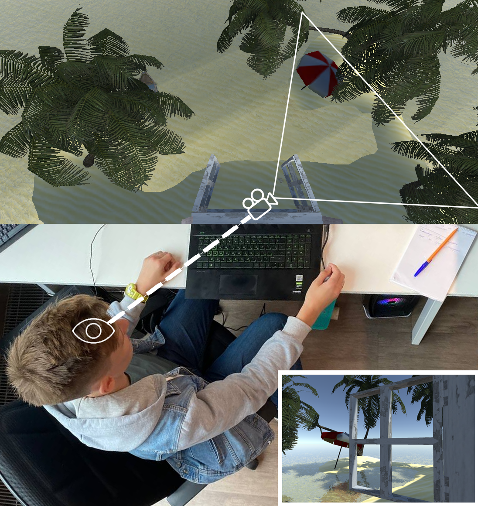

# Window to the sea

This project is implemented on Unity3D and its main feature is the image adaptive to the point of view. The program detects a face on a webcam image. Then it changes the position of the camera in the scene to create a 3d effect. This creates the effect of a real window into the 3d world.

